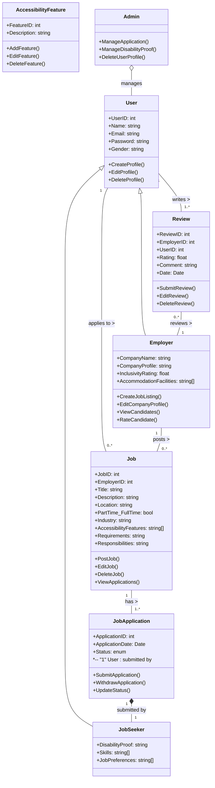

# IncluWork-final project

## Description
IncluWork is a full stack web application aimed at providing job opportunities to differently abled individuals, addressing human rights and equality issues as outlined by the UN. The platform facilitates employment by connecting job seekers with inclusive employers who offer accommodations and support services to create an accessible work environment. Job seekers can create profiles, while employers can post job listings and review candidates. Admin verification ensures that disability proofs provided by job seekers are valid before completing job applications. The system matches job seeker skills with employer job preferences to enhance job placement.

## Users
IncluWork targets two main user groups:
- **Job Seekers**: Differently abled individuals looking for employment opportunities. They can create profiles, search for jobs, and apply to positions that match their skills and preferences.
- **Employers**: Companies committed to diversity and inclusivity, offering job opportunities and accommodations for differently abled individuals. Employers can post job listings, review candidates and receive inclusivity rating.

## Technologies Used
- **Frontend**: Utilizing React.js, a powerful library for crafting dynamic and engaging user interfaces.
- **Backend**: Employing Node.js in conjunction with Express.js to manage server-side operations and develop robust APIs.
- **Database**: Leveraging MongoDB, a flexible and scalable NoSQL database, to store diverse user data, environmental statistics, and content efficiently.

## Feature Highlights
- **User Profiles**: Job seekers and employers can create and manage their profiles, showcasing their skills, preferences, and company details.
- **Job Listings**: Employers can post job listings, specifying job requirements and accommodations for differently abled individuals.
- **Application Management**: Job seekers can apply to job listings, and employers can manage applications, review candidates, and rate inclusivity.
- **Admin Verification**: Admin verifies disability proofs provided by job seekers to ensure the authenticity of applications.

## Addressing Global Issues
IncluWork directly addresses global issues related to human rights and equality, particularly focusing on the employment of differently abled individuals. By providing a platform where job seekers and inclusive employers can connect, the application promotes diversity and inclusivity in the workforce, aligning with the UN's initiatives for equal opportunities and rights for all individuals.

## Object Model (Mermaid Code)

### Entities

**User:** Represents a user of the system, which can be either a job seeker or an employer. It contains attributes such as UserID, Name, Email, Password, and Gender.

**JobSeeker:** Represents a job seeker, containing attributes like DisabilityProof, Skills, and JobPreferences.

**Employer:** Represents an employer, containing attributes like CompanyName, CompanyProfile, InclusivityRating, and AccommodationFacilities.

**Job:** Represents a job listing, containing attributes like JobID, EmployerID, Title, Description, Location, PartTime_FullTime, Industry, AccessibilityFeatures, Requirements, and Responsibilities.

**JobApplication:** Represents an application submitted by a job seeker for a particular job listing. It contains attributes like ApplicationID, ApplicationDate, and Status.

**Review:** Represents a review submitted by a user (typically a job seeker) for an employer. It includes attributes like ReviewID, EmployerID, UserID, Rating, Comment, and Date.

**AccessibilityFeature:** Represents a feature related to accessibility that can be associated with a job listing. It contains attributes like FeatureID and Description.

**Admin:** Represents an administrator of the system, with functions to manage applications, disability proofs, and user profiles.

### Value Objects

**UserID, JobID, ApplicationID, ReviewID, FeatureID:** These are unique identifiers for users, jobs, job applications, reviews, and accessibility features, respectively.

**Name, Email, Password, Gender, DisabilityProof, CompanyName, CompanyProfile:** These are attributes that hold values related to user and employer profiles, job listings, and reviews.

### Relationships and Relationship Types

**User to JobSeeker/Employer:** Inheritance relationship, denoted by the "<|--" arrow. Indicates that a User can be either a JobSeeker or an Employer.

**User to Job:** Association relationship, denoted by the "--" arrow. Indicates that a User (JobSeeker or Employer) can apply to multiple Jobs.

**Job to JobApplication:** Association relationship, denoted by the "--" arrow. Indicates that a Job can have multiple JobApplications.

**User to Review:** Association relationship, denoted by the "--" arrow. Indicates that a User (JobSeeker) can write multiple Reviews for Employers.

**Employer to Job:** Association relationship, denoted by the "--" arrow. Indicates that an Employer can post multiple Jobs.

**JobApplication to JobSeeker:** Composition relationship, denoted by the "*--" arrow. Indicates that a JobApplication is composed of one JobSeeker, meaning that the existence of a JobApplication depends on the existence of a JobSeeker.

**Review to Employer:** Association relationship, denoted by the "--" arrow. Indicates that an Employer can receive multiple Reviews.

### Cardinality

**User to JobSeeker/Employer:** One-to-many relationship. One User can be associated with either one JobSeeker or one Employer.

**User to Job:** One-to-many relationship. One User (JobSeeker or Employer) can apply to multiple Jobs.

**Job to JobApplication:** One-to-many relationship. One Job can have multiple JobApplications.

**User to Review:** One-to-many relationship. One User (JobSeeker) can write multiple Reviews for Employers.

**Employer to Job:** One-to-many relationship. One Employer can post multiple Jobs.

**JobApplication to JobSeeker:** One-to-one relationship. Each JobApplication is associated with exactly one JobSeeker.

**Review to Employer:** One-to-many relationship. One Employer can receive multiple Reviews.

**Explanation:**

Entities represent the main objects in the system, each with its own set of attributes and behaviors.
Value objects are attributes that hold specific values associated with the entities.
Relationships depict how entities are related to each other, indicating the associations, compositions, or inheritances between them.
Cardinality defines the multiplicity of the relationships, specifying how many instances of one entity can be associated with another entity.

## REST API resources and the User stories

### Feature: Job Seeker Profile Management

- **User Story:** As a job seeker, I want to create my profile to apply for job listings.
  - Endpoint: POST /jobseekers

- **User Story:** As a job seeker, I want to view my profile to review or update my personal information and qualifications.
  - Endpoint: GET /jobseekers/{userID}

- **User Story:** As a job seeker, I want to update my profile to keep my personal information and qualifications current.
  - Endpoint: PUT /jobseekers/{userID}

- **User Story:** As a job seeker, I want to delete my profile if I no longer need to use the platform.
  - Endpoint: DELETE /jobseekers/{userID}

### Feature: Job Application Tracking

- **User Story:** As a job seeker, I want to view all my job applications to track their status and manage my job search effectively.
  - Endpoint: GET /jobseekers/{userID}/applications

### Feature: Job Listings Management

- **User Story:** As an employer, I want to post a new job listing to find qualified candidates for my open positions.
  - Endpoint: POST /jobs

- **User Story:** As a user, I want to view available job listings to find positions that match my skills and interests.
  - Endpoint: GET /jobs

- **User Story:** As an employer, I want to edit the details of my job listing to ensure it is accurate and up-to-date.
  - Endpoint: PUT /jobs/{jobID}

### Feature: Job Application Process

- **User Story:** As a job seeker, I want to withdraw my job application if I am no longer interested in the job or have accepted another offer.
  - Endpoint: DELETE /jobapplications/{applicationID}

- **User Story:** As a job seeker, I want to apply for a job listing to pursue employment opportunities.
  - Endpoint: POST /jobapplications

### Feature: Employer Profile Management

- **User Story:** As an employer, I want to create my company profile to attract potential candidates and showcase my company culture and values.
  - Endpoint: POST /employers

- **User Story:** As a user, I want to view an employer's profile to learn more about the company and its employment opportunities.
  - Endpoint: GET /employers/{employerID}

- **User Story:** As an employer, I want to update my company profile to keep information current and appealing to job seekers.
  - Endpoint: PUT /employers/{userID}

### Feature: Review Management

- **User Story:** As a user, I want to delete a review I posted for an employer if my opinion has changed or the review is no longer relevant.
  - Endpoint: DELETE /reviews/{reviewID}

- **User Story:** As a user, I want to create a review for an employer to share my employment experience and help others make informed decisions.
  - Endpoint: POST /reviews

### Feature: User and Role Management

- **User Story:** As an admin, I want to create user accounts and assign roles to streamline the onboarding process and ensure users have appropriate access.
  - Endpoint: POST /admin/users

### Feature: Application Oversight

- **User Story:** As an admin, I want to view all job applications to oversee the job application process and ensure it runs smoothly.
  - Endpoint: GET /jobapplications

- **User Story:** As an admin, I want to update the status of job applications to reflect changes in their review process or outcomes.
  - Endpoint: PUT /admin/jobapplications/{applicationID}

### Feature: User Profile Management

- **User Story:** As an admin, I want to delete any user profile that violates platform policies or upon user request to maintain a safe and professional environment.
  - Endpoint: DELETE /admin/users/{userID}

- **User Story:** As an admin, I want to view all users to monitor the platform's user base and ensure compliance with platform policies.
  - Endpoint: GET /admin/users

- **Apurva Raj**
  - Email: apurvaraj9808@gmail.com

